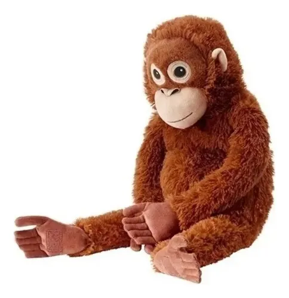

# clase 01
 ## 10 cualidades de la coni ##
 * soy alergica a las almendras
 * mi genero fav de musica es el mambo chileno
 * tengo 4 hermanos chicos
 * cuando chica me pico una araña de rincon
 * tengo fobia a los pies
 * tengo una muela al reves
 * mi peli fav es "edge of tomorrow"
 * uso is pesadillas como referente artistico 
## apuntes sobre "la estetica como cosmologia"
* exite una diferencia entre la realidad interna (ejecucion) y su apariencia o descripcion (imagen)
* esta diferencia pasa en todos los objetos del mundo
* el lenguaje como tel no puede captar la realidad de estas cosas
* la **metafora** une dos objetos distintos y crea una nueva experiencia
#### entonces, ¿entonces como sabemos que esa realidad existe? ####
no podemos verla, ni medirla,ni comprobarla.

## aki esta mi primera imagen ;p

